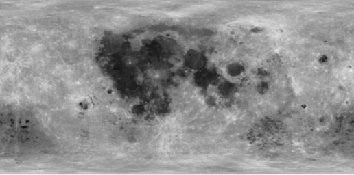
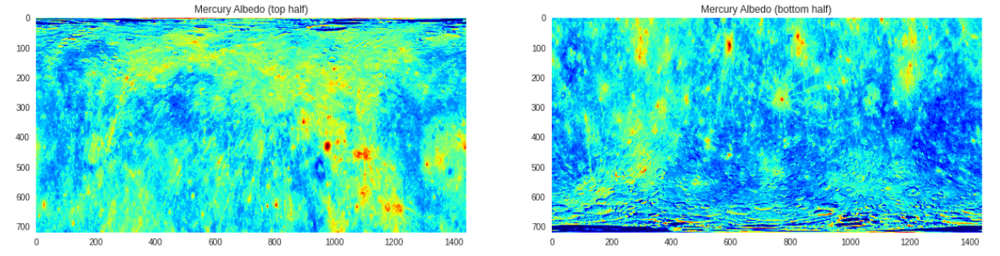
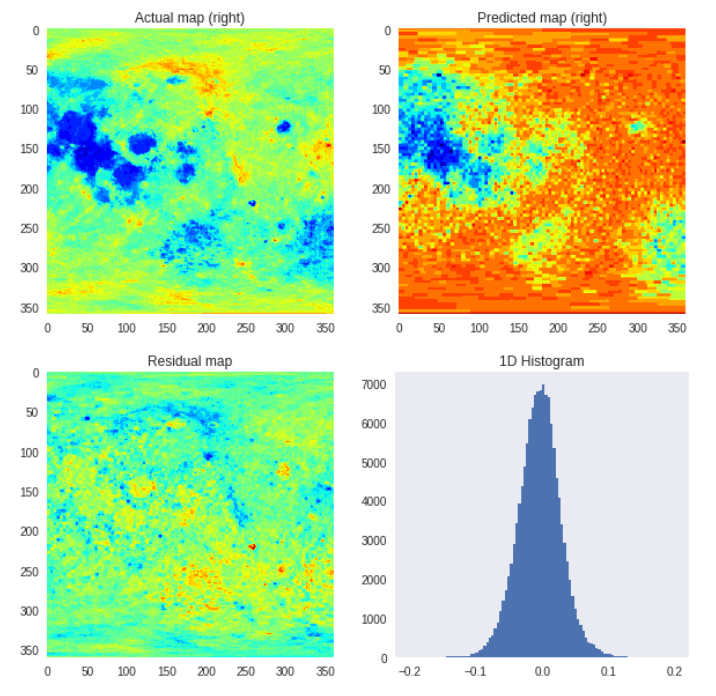
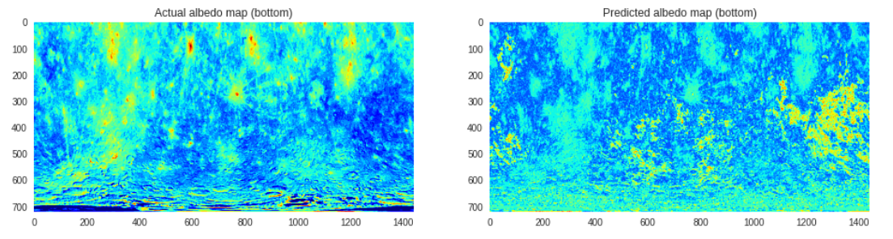
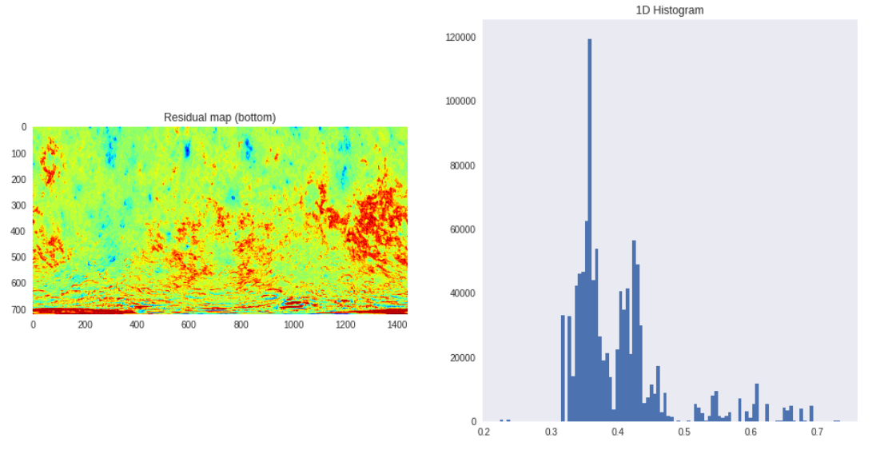

# ml-mapper
This repository contains the attempts to the evaluation task for ML4SCI's project "Machine Learning Model for the Planetary Albedo".

# Analysis

### Lunar Albedo Map Prediction
Out of the several models tested, `XGBoostRegressor` gives the least Root Mean Squared Error (RMSE) ~ 0.03.

**Lunar - Actual Map**

### Mercury Albedo Map Prediction
The `XGBoostRegressor` gives RMSE value ~ 0.16. Other regressors, for example the `LinearSVR`, give similar results as the `XGBoostRegressor`. For the case of mercury, the chemical composition maps were predicted before predicting the albedo maps.

**Mercury - Actual Map**

**Prediction Results**

### Lunar Albedo

### Mercury Albedo

