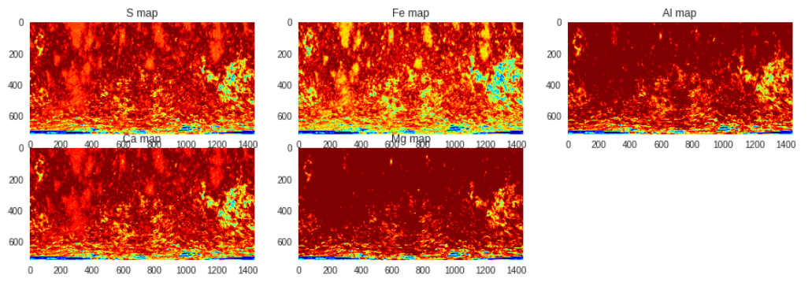

# ml-mapper
This repository contains analysis for the topic "Machine Learning for the Planetary Albedo".

## Analysis

### Lunar Albedo Map
Out of the several models tested, `XGBoostRegressor` gives the least Root Mean Squared Error (RMSE) ~ 0.03.

**Lunar - Actual Map**

### Mercury Albedo Map
The `XGBoostRegressor` gives RMSE value ~ 0.16. Other regressors, for example the `LinearSVR`, give similar results as the `XGBoostRegressor`. For the case of mercury, the chemical composition maps were predicted before predicting the albedo maps.

**Mercury - Actual Map**

### Prediction Results

**Lunar Albedo Map Prediction**

**Mercury Element Map Prediction**

**Mercury Albedo Map Prediction**

